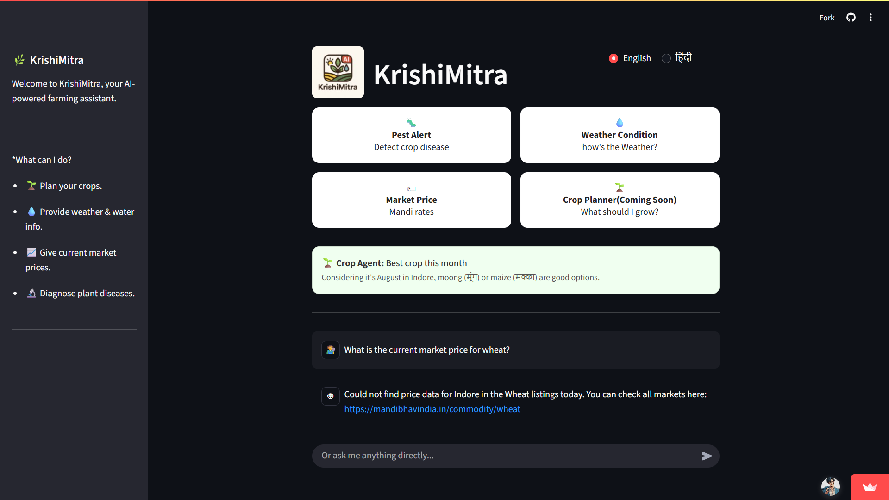
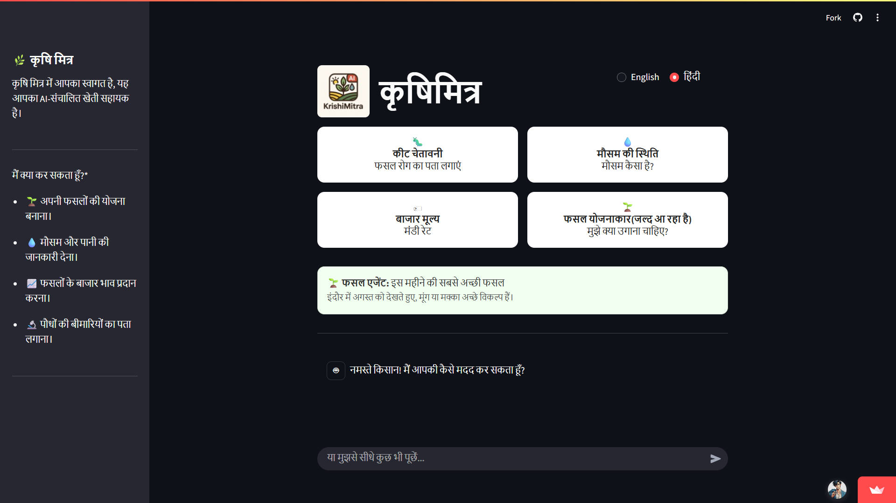

# 🌿 KrishiMitra - AI Assistant for Farmers

[](https://www.python.org/downloads/)
[](https://streamlit.io)
[](https://www.tensorflow.org/)

KrishiMitra is a bilingual, AI-powered conversational agent designed to provide small farmers with critical information about market prices, weather forecasts, and real-time plant disease diagnosis.

## ✨ Screenshots

<p align="center">
  
  &nbsp;
  
</p>

## 🎯 Problem Statement & SDG Alignment

This project addresses the critical need for accessible, real-time agricultural information for small farmers, who often lack the resources for timely decision-making. By providing instant diagnoses and data, KrishiMitra directly contributes to:

* **SDG 1: No Poverty**
* **SDG 2: Zero Hunger**
* **SDG 13: Climate Action**

## 🚀 Features

* **🗣️ Bilingual Chat Interface:** Fully functional in both English and Hindi.
* **🔬 Pest Alert Agent:** Upload a photo of a plant leaf and get an instant AI-powered diagnosis with a confidence score.
* **🌦️ Water Management Agent:** Get a simple, real-time weather forecast.
* **📈 Market Price Agent:** Get current market prices for key crops like Soybean and Wheat.
* **🖼️ Test Images Provided:** Sample images are available in the `assets/test_images` folder to test the app quickly.

## 🛠️ Tech Stack

* **Frontend:** Streamlit
* **Backend & ML:** Python, TensorFlow, Keras
* **Key Libraries:** NumPy, Pandas, OpenCV
* **APIs:** OpenWeatherMap (for weather forecast)

## ⚙️ Getting Started

### Prerequisites

* Python 3.11+
* Git

### Installation & Setup

1. **Clone the repository:**

   ```sh
   git clone https://github.com/shivamr021/KrishiMitra-AI
   cd KrishiMitra-AI
   ```
2. **Create and activate a virtual environment:**

   ```sh
   # For Windows
   python -m venv .venv
   .\.venv\Scripts\activate

   # For macOS/Linux
   python -m venv .venv
   source .venv/bin/activate
   ```
3. **Install the required dependencies:**

   ```sh
   pip install -r requirements.txt
   ```

### Usage

To run the application, execute the following command from the root directory:

```sh
streamlit run app.py
```

The application will open in your default web browser.

## 🌐 Live Demo & Links

* **Live Demo:** [KrishiMitra-AI App](https://krishimitra-ai.streamlit.app/)
* **Medium Post:** [From Late-Night Debugging to Real-World Impact – The Journey of Building KrishiMitra-AI](https://medium.com/@shivamr021/from-late-night-debugging-to-real-world-impact-the-journey-of-building-krishimitra-ai-b6abac88edaa)
* **LinkedIn Post:** [Celebrating Our Top 8 Finalist Achievement](https://www.linkedin.com/posts/shivamrathod021_ai-machinelearning-multiagentsystems-activity-7360671509922656256-2gDs)
* **X Post:** [KrishiMitra-AI on X](https://x.com/shivamr017/status/1954815060078907478)

## 🏆 Recognition

6 days. 8 teammates. 1 deployed AI app. **Top 8 Finalist**. 🌟

We’re thrilled to share that our team, **Code Push Pray**, was selected as a **Top 8 team** in the IBM SkillsBuild cohort for our final project, **KrishiMitra-AI**!

In just one week, we built and deployed a bilingual, multi-agent AI assistant that empowers small-scale farmers with instant, actionable insights:

* 🔍 Pest & disease detection from photos
* 💹 Live market prices with a robust fallback
* ☔ Localized weather forecasts

This journey was intense and rewarding — late nights, nonstop learning, and teamwork that made this possible.

We’re grateful to **IBM SkillsBuild** & **CSRBOX** for the opportunity, and to our incredible teammates for making this achievement possible.

## 👥 Our Team

This project was built as part of the IBM SkillsBuild AI-ML Internship by **Team Code Push Pray**.

| Name                 | Role                    | GitHub Profile                              | LinkedIn Profile                                                   |
| -------------------- | ----------------------- | ------------------------------------------- | ------------------------------------------------------------------ |
| **Shivam Rathod**    | Team Lead / Integrator  | [GitHub](https://github.com/shivamr021)     | [LinkedIn](https://www.linkedin.com/in/shivamrathod021/)           |
| **Shatakshi Tiwari** | Co-Lead / CV Lead       | [GitHub](https://github.com/Shatakshi0216)  | [LinkedIn](https://www.linkedin.com/in/shatakshitiwari017/)        |
| **Sahil Kukreja**    | Co-Lead / Agent Lead    | [GitHub](https://github.com/Sahilkukreja30) | [LinkedIn](https://www.linkedin.com/in/sahil-kukreja-943993289/)   |
| **Parth Soni**       | Co-Lead / Documentation | [GitHub](https://github.com/parthsoni05)    | [LinkedIn](https://www.linkedin.com/in/parth-soni-1a85b128b/)      |
| **Sumedha Mandloi**  | Frontend / Jr. Dev      | [GitHub](https://github.com/sumedhamandloi) | [LinkedIn](https://www.linkedin.com/in/sumedha-mandloi-5a1250318/) |
| **Rachit Neema**     | Frontend / Jr. Dev      | [GitHub](https://github.com/Rachitneema03)  | [LinkedIn](https://www.linkedin.com/in/rachit-neema/)              |
| **Nitika Jain**      | Documentation / Jr. Dev | [GitHub](https://github.com/nitikajain25)   | [LinkedIn](https://www.linkedin.com/in/nitika-jain-b8690b353/)     |
| **Prashansa Hirve**  | Documentation / Jr. Dev | [GitHub](https://github.com/PrashansaHirve) | [Linkedin](https://www.linkedin.com/in/prashansa-hirve-01ba85333/) |

## 🙏 Acknowledgments

* **IBM SkillsBuild** for the internship opportunity.
* **PlantVillage Dataset** for providing the data for our disease detection model.
* The developers of **TensorFlow** and **Streamlit**.
